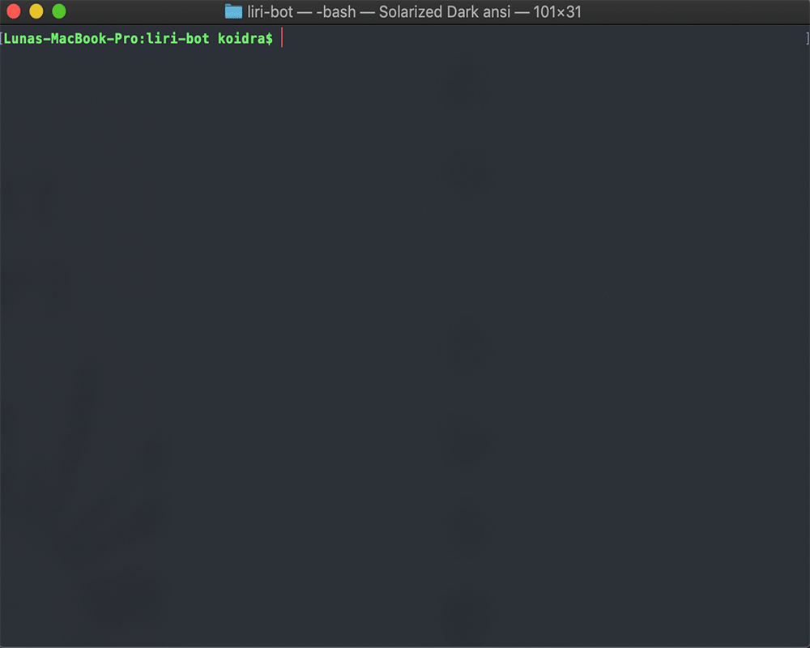

# **LIRI BOT**

>In this assignment, you will make LIRI. LIRI is like iPhone's SIRI. However, while SIRI is a Speech Interpretation and Recognition Interface, LIRI is a Language Interpretation and Recognition Interface. LIRI will be a command line node app that takes in parameters and gives you back data.Parameters that can be used to use LIRI are the following: `spotify-this-song` `moviethis` `do-what-it-says` `concert-this`

## Deployment
1. Clone this repository.
2. Run  `$ npm install`.
3. In the terminal run `node liri.js` and pass in desired parameter.

## Technologies Utilized 

* NodeJs
* Javascript
* Spotify API
* Bands In Town API
* OMDB API
* NPM dotenv
* NPM axios
* NPM node-spotify-api
* NPM moment